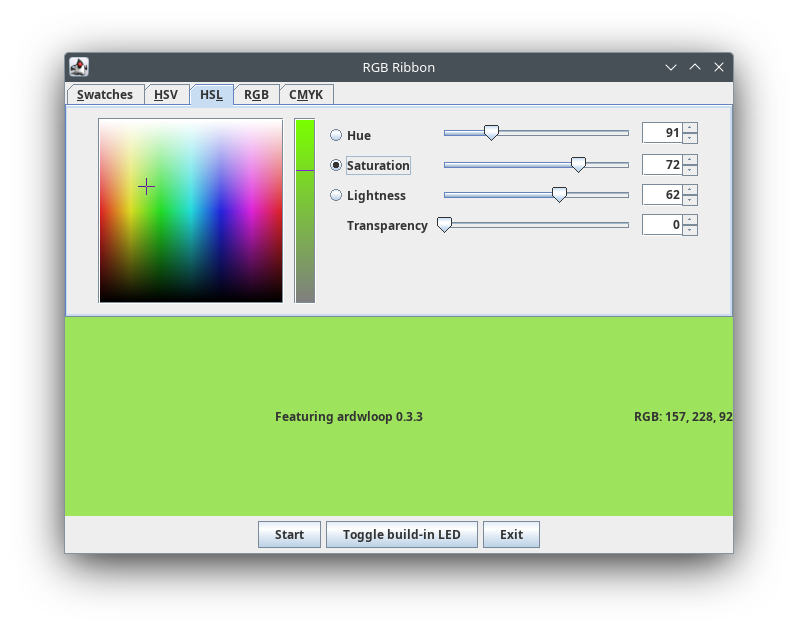

# rgb-ribbon-demo

***Work in progress...***

A lightweight desktop application to control a RGB led strip or ribbon plugged into an Arduino board.



Features the [ardwloop](https://github.com/llschall/ardwloop) library.

## Setup (Windows / Linux)

Run the following from any folder.

```
git clone https://github.com/llschall/rgb-ribbon-demo;
./rgb-ribbon/gradlew -p rgb-ribbon-demo run;
```
